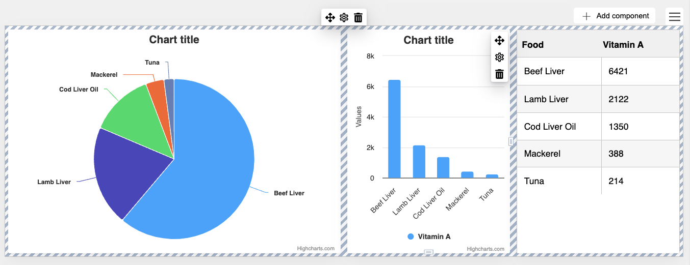

Edit mode
===

Edit mode is a mode in which the user can change the appearance of the dashboard through the User Interface (UI).
To be able to use Dashboards with layout system and editmode you first have to load the editmode module.
The order of the imports is important, so make sure that the EditMode module is imported after the Dashboards module.

```html
    <script src="https://code.highcharts.com/dashboards/dashboards.js"></script>
    <script src="https://code.highcharts.com/dashboards/modules/editmode.js"></script>
```


In addition, this option has to be enabled in the dashboard config:
```js
editMode: {
    enabled: true,
    contextMenu: {
        enabled: true,
        items: ['editMode']
    }
},
```

Edit mode can now be enabled by the burger menu in the upper right corner.


When edit mode is enabled, the appearance of the dashboard changes. When hovering over a cell a blue border appears around it. The border of the row containing the cell turns green. Additionally, both the row and the cell get a tooltip, which allows the user to change its position, change its options, or just delete it.



Next to the burger menu, the [Add Component](#add-component) button is added.


## Add Component

The `Add Component` button allows the user to add a new component. When clicked, a sidebar appears, which lets you choose the type of component you want to add and then by drag&drop component type can be selected and dragged to the correct place, which is also indicated by the drop marker.

The sidebar lists the component types provided by the Dashboards API but only the ones whose modules are loaded. If other types are needed, add the extra modules. The order and the components on the list can be changed by setting the `components` array in the `editMode` option - [API](https://api.highcharts.com/dashboards/#interfaces/Dashboards_EditMode_EditMode.EditMode.Toolbars#sidebar).

In order to add other custom components to the list, please follow the [custom component guide](https://www.highcharts.com/docs/dashboards/custom-component).


After dragging a component into the preferred place in the layout, a sidebar with the [component settings](https://www.highcharts.com/docs/dashboards/edit-mode#component-settings) will appear.


## Component settings

Each component type has its own properties. The most important ones can be set using the settings sidebar. It opens automatically after adding any component, but it can also be opened by clicking on the gear icon that appears in the toolbar that opens after clicking on a cell in the edit mode.


Below you can see the settings categories for the [Highcharts Component](https://www.highcharts.com/docs/dashboards/highcharts-component).


The first three categories, `Connector name`, `Title` and `Caption`, are options that are also shared by other components. In `Connector name` you can connect an existing connector that will provide data to the component (in this case, a chart). The rest of the options are typical for this component. You can use them to configure the appearance of the chart.

If you do not intend to use the connector, you can set the data using the component's internal options. In [Highcharts Component](https://www.highcharts.com/docs/dashboards/highcharts-component) you can do this by defining data in the [`series.data`](https://api.highcharts.com/highcharts/series.line.data) option. In the [KPI Component](https://www.highcharts.com/docs/dashboards/kpi-component), by setting the [`value`](https://api.highcharts.com/dashboards/#interfaces/Dashboards_Components_KPIComponent.KPIComponent.ComponentOptions#value) option.

Check how the component settings sidebar works in practice using the [edit mode live example](https://www.highcharts.com/docs/dashboards/edit-mode#edit-mode-live-example).


## Customizing the context menu

The `contextMenu` option also allows you to edit, what should be inside the menu, which shows after clicking on the burger menu.  The items can either be a string like `editMode` if it is a default button, or an object, which defines the button name, `onclick` event and some more options. Here is the example snippet of context menu button configuration:
```js
items: [{
    id: 'custom-id',
    type: 'toggle',
    text: 'Custom Name',
    events: {
        click: function () {
            // onClick Event
        }
    }
}]
```


## Edit mode live example

Use the context menu on the upper-right corner to enable and explore the edit mode.
<iframe style="width: 100%; height: 600px; border: none;" src="https://www.highcharts.com/samples/embed/dashboards/edit-mode/ctx-enabled" allow="fullscreen"></iframe>
